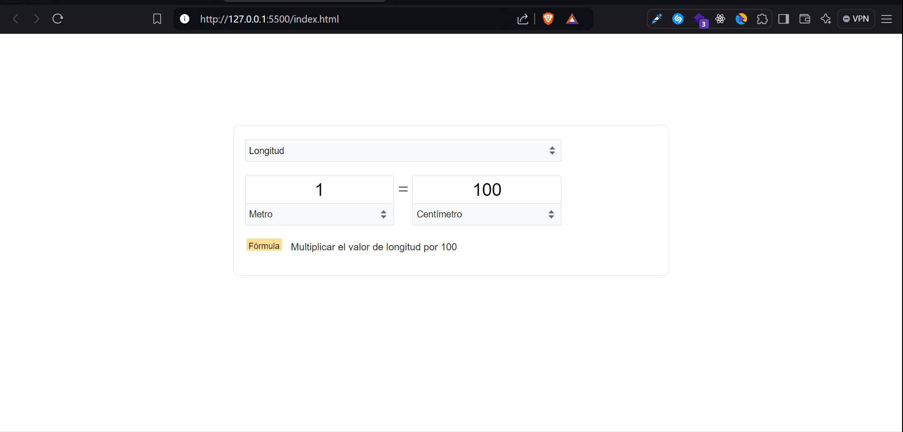

# Conversor de unidades tipo Google

Convesor de unidades con el funcionamiento además del diseño del conversor de unidades de Google.

__Características:__
- Cambio dinámico de formulas
- Cambio dinámico de select, (recuerda el select contrario anterior)
- Permite notación cientifica
- Multiplicación de signos y más...

 

Vista previa:

